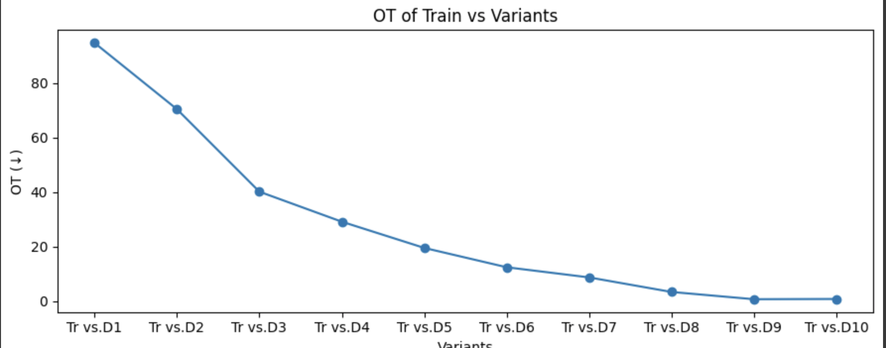
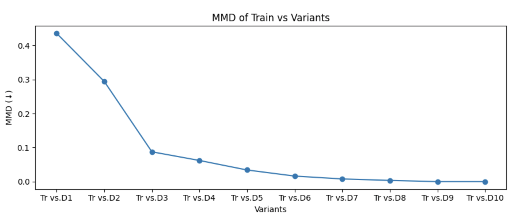
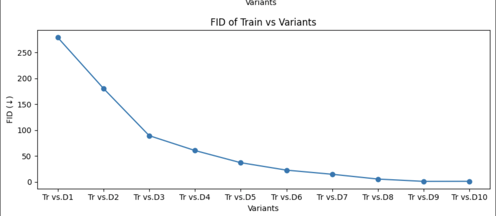
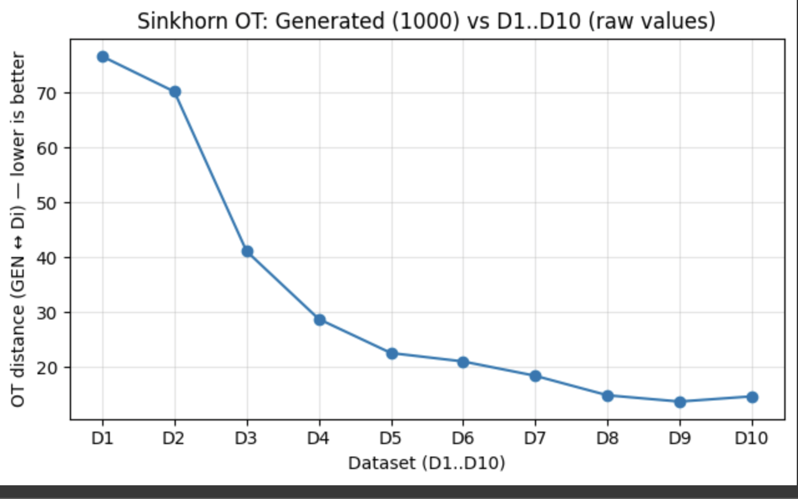
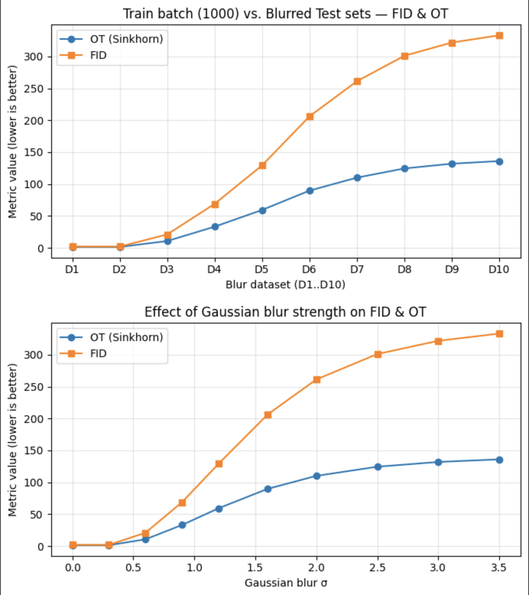
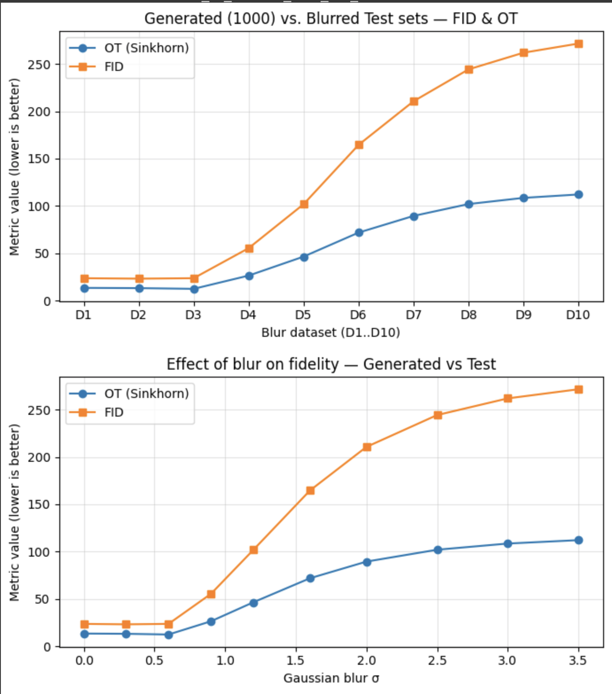
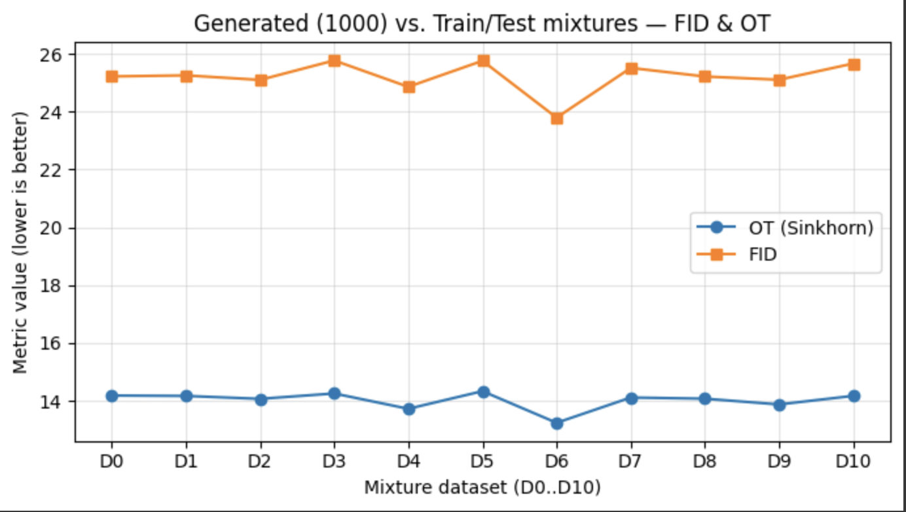

# Computer Vision Lab
## Submitters:    Sameer Najjar, ID:   Rami Sima'an, ID: 212272751

## Introduction
Great-looking samples don’t always mean a model matches the real data. Common scores (like FID) help, but they can miss problems such as class imbalance, duplicates, or missing modes. Our goal is simple: check how far the model’s samples are from the real data and make that gap smaller.

We built a two-phase pipeline: first we measure the gap, then we reduce it.
By “reduce,” we mean we use the measurement to nudge the model’s outputs toward the real distribution so the mismatches shrink and the samples become more diverse and faithful.

## Our Work

### Pasive Phase 
**Goal.** Measure the distance between samples and real distributions in the SimpleMNISTFeatureNet embedding and summarize it with OT/FID/MMD.
#### Setup:
1. Using generated samples from a fixed feature space (SimpleMNISTFeatureNet).
2. Reference (train) subset: Balanced mini-set from the train data (same count per digit/class).
3. Controlled test variants ($D_1$->$D_{10}$): 1,000 samples each, increasing diversity:
    - $D_1$: 1 digit, 1 image duplicated.
	- $D_2$: 1 digit, as many distinct as possible (pad if needed).
	- $D_3–D_8$: 2,3,4,5,6,8 digits — balanced and distinct.
	- $D_9$: 10 digits — balanced, with replacement (duplicates allowed).
	- $D_{10}$: 10 digits — balanced, distinct (best diversity).
4. Metrics we compute: OT, FID and MMD.

### *$D_1, ..., D_{10}$ $Vs.$   $Train$*:
We plot OT/FID/MMD between each controlled test set $D_1\ldots D_{10}$ and the balanced train reference $\mathrm{Train}$ in the SimpleMNISTFeatureNet embedding. Lower = better (closer to train); as diversity increases from $D_1$ to $D{_10}$, distances should drop—note that $D_9$ can be slightly lower than $D_{10}$ because it allows duplicates.

### Coverage (GEN vs D_1–D_{10}):

Sinkhorn OT between 1k generated samples and controlled test sets with rising diversity (${D_1}$ worst → $D_{10}$ best) in the SimpleMNISTFeatureNet embedding. Lower = better; the downward trend shows broader coverage. A tiny $D_9$ < $D_10$ dip is expected since $D_9$ allows duplicates (easier to match).

### Precision (Train vs Blurred Test — $D_1$-$D_{10}$)
Distances (OT, FID) between a 1k train batch and blurred test variants $D_1\ldots D_{10}$ (blur strength ↑). Lower = better. Both metrics rise as blur increases; FID reacts earlier/steeper, OT grows smoothly.

Effect of Gaussian blur σ (Train vs Test).
Same experiment but x-axis is the actual blur $\sigma$. Lower = better. Metrics increase monotonically with $\sigma$, confirming sensitivity to precision/sharpness loss (FID steeper at small $\sigma$; OT smoother overall).

### Precision (Generated vs Blurred Test — $D_1$-$D_{10}$)

### Train/Test Mixture Sweep (GEN vs $D_0\ldots D_{10}$).
Each $D_k$ is a 1k-image mix with $k\times100$ train and $(10-k)\times100$ test images (so $D_0$=all test, $D_{10}$=all train). We measure OT and FID between Generated (1k) and each mixture. Lower = better.
 
The generator shows no strong train/test bias—it’s similarly aligned to both. The slight dip may indicate a tiny train preference or just sampling noise 
