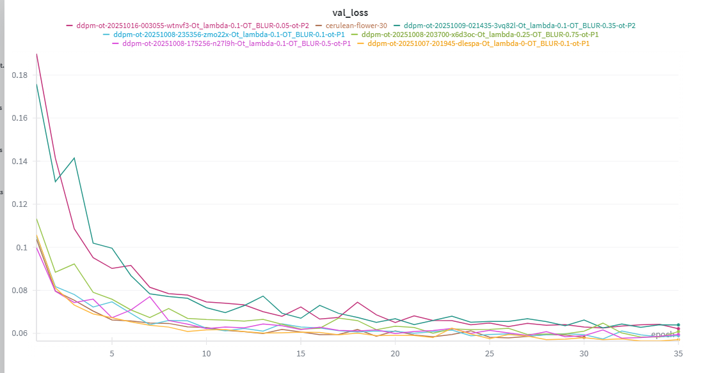
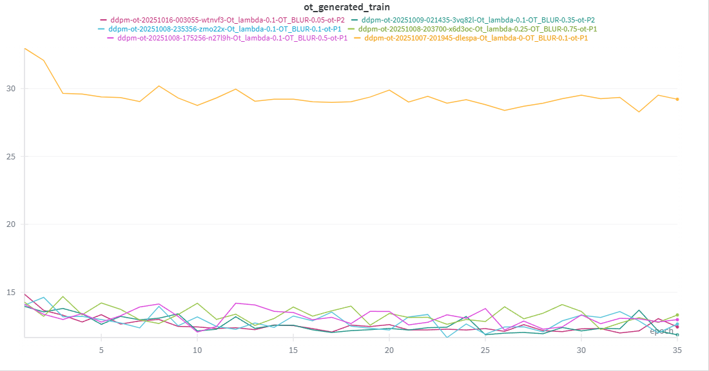
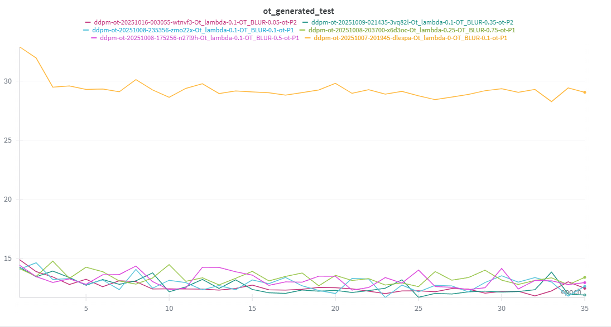
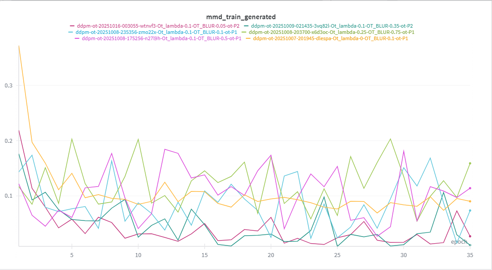
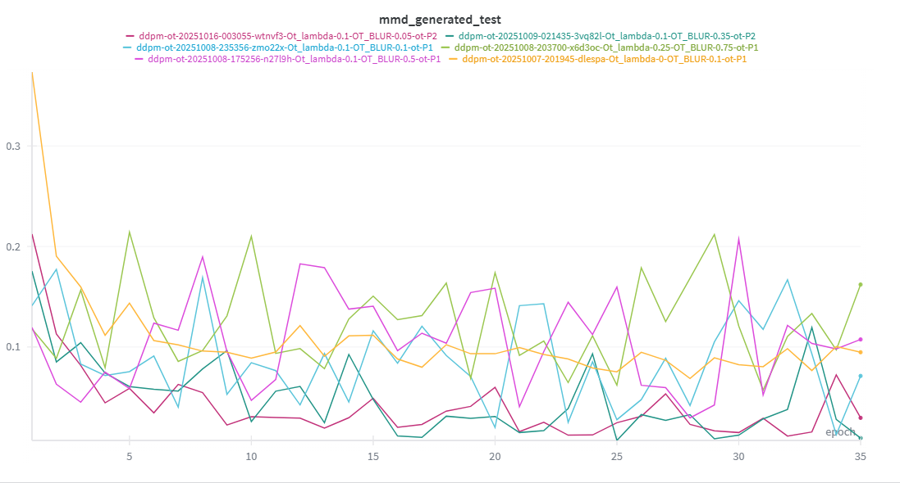
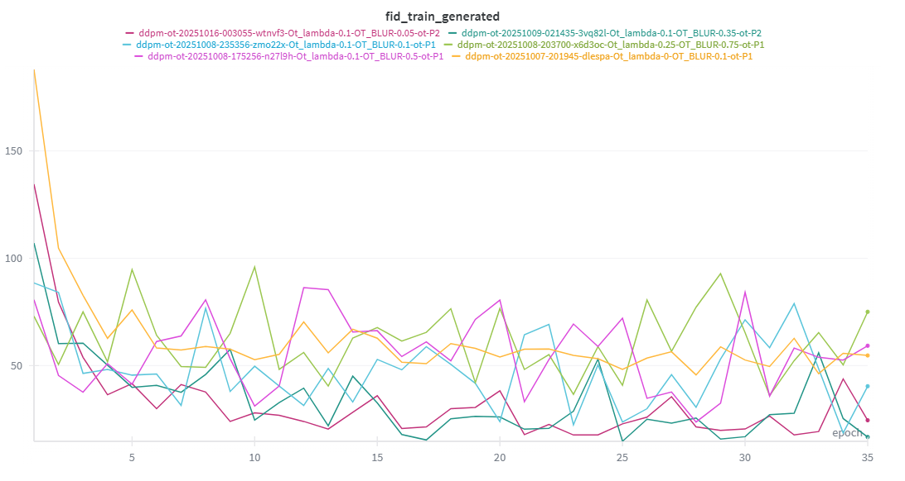
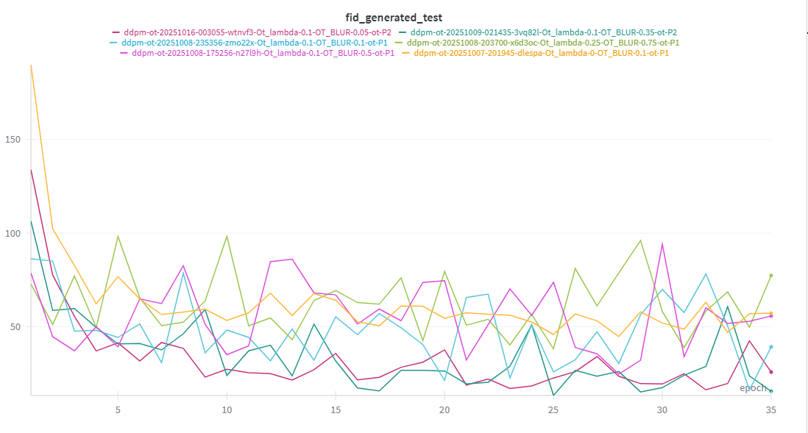
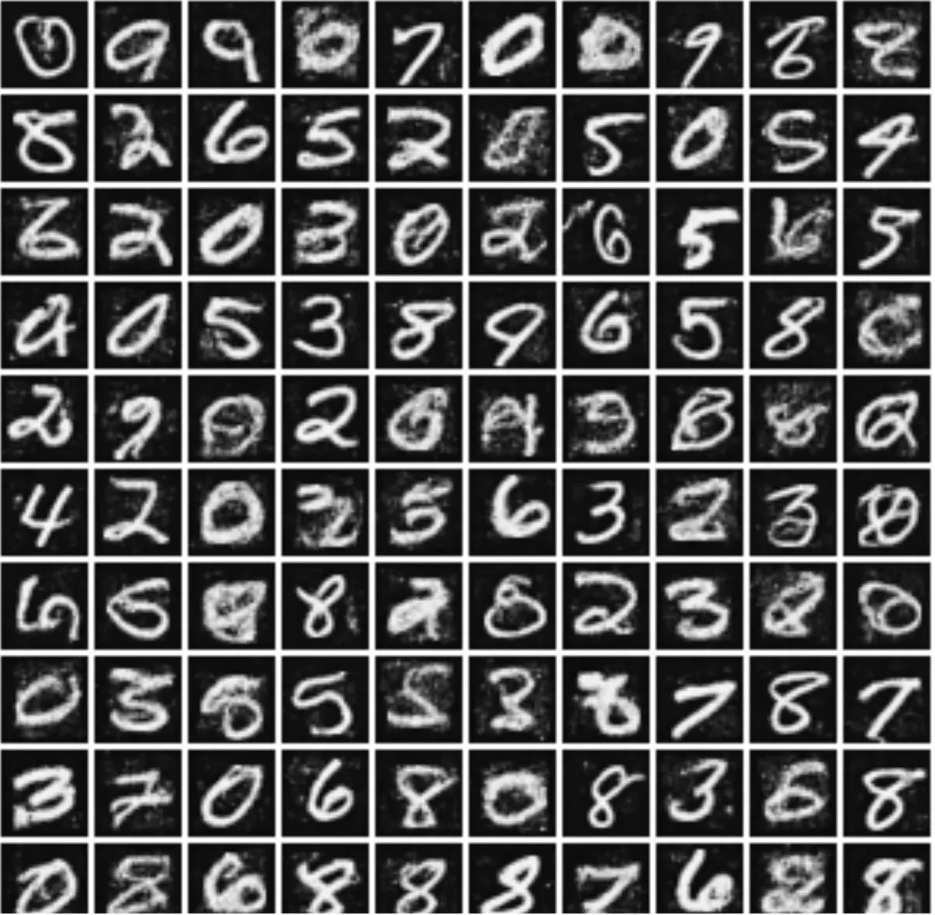
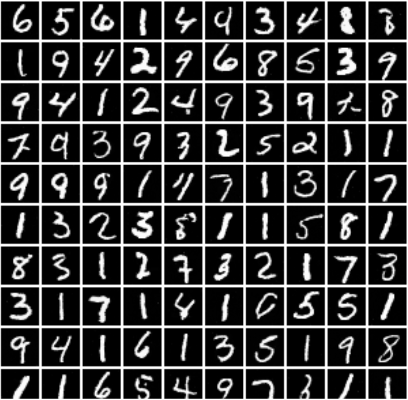

# Computer Vision Lab
## Submitters: </br><br> Sameer Najjar, ID: 212186613 </br> Rami Sima'an, ID: 212272751


## Introduction
Great-looking samples don’t always mean a model matches the real data. Common scores (like FID) help, but they can miss problems such as class imbalance, duplicates, or missing modes. Our goal is simple: check how far the model’s samples are from the real data and make that gap smaller.

We built a two-phase pipeline: first we measure the gap, then we reduce it.
By “reduce,” we mean we use the measurement to nudge the model’s outputs toward the real distribution so the mismatches shrink and the samples become more diverse and faithful.


## Our Work

### Pasive Phase 
**Goal.** Measure the distance between samples and real distributions in the SimpleMNISTFeatureNet embedding and summarize it with OT/FID/MMD.
#### Setup:
1. Using generated samples from a fixed feature space (SimpleMNISTFeatureNet).
2. Reference (train) subset: Balanced mini-set from the train data (same count per digit/class).
3. Controlled test variants ($D_1$-> $D_{10}$): 1,000 samples each, increasing diversity:
	- $D_1$: 1 digit, 1 image duplicated.
	- $D_2$: 1 digit, as many distinct as possible (pad if needed).
	- $D_3–D_8$: 2,3,4,5,6,8 digits — balanced and distinct.
	- $D_9$: 10 digits — balanced, with replacement (duplicates allowed).
	- $D_{10}$: 10 digits — balanced, distinct (best diversity).
4. Metrics we compute: OT, FID and MMD.

### $D_1, ..., D_{10}$ Vs.   Train:
We plot OT/FID/MMD between each controlled test set $D_1 \dots D_{10}$ and the balanced train reference $\mathrm{Train}$ in the SimpleMNISTFeatureNet embedding. Lower = better (closer to train); as diversity increases from $D_1$ to $D{_10}$, distances should drop—note that $D_9$ can be slightly lower than $D_{10}$ because it allows duplicates.


### Coverage (GEN vs $D_1$, ..., $D_{10}$):

Sinkhorn OT between 1k generated samples and controlled test sets with rising diversity (${D_1}$ worst → $D_{10}$ best) in the SimpleMNISTFeatureNet embedding. Lower = better; the downward trend shows broader coverage. A tiny $D_9$ < $D_{10}$ dip is expected since $D_9$ allows duplicates (easier to match).


### Precision (Train vs Blurred Test — $D_1$ -> $D_{10}$)
Distances (OT, FID) between a 1k train batch and blurred test variants $D_1\ldots D_{10}$ (blur strength ↑). Lower = better. Both metrics rise as blur increases; FID reacts earlier/steeper, OT grows smoothly.

Effect of Gaussian blur σ (Train vs Test).
Same experiment but x-axis is the actual blur $\sigma$. Lower = better. Metrics increase monotonically with $\sigma$, confirming sensitivity to precision/sharpness loss (FID steeper at small $\sigma$; OT smoother overall).


### Precision (Generated vs Blurred Test — $D_1$ -> $D_{10}$


### Train/Test Mixture Sweep (GEN vs $D_0\ldots D_{10}$).
Each $D_k$ is a 1k-image mix with $k\times100$ train and $(10-k)\times100$ test images (so $D_0$=all test, $D_{10}$=all train). We measure OT and FID between Generated (1k) and each mixture. Lower = better.  
</br>
The generator shows no strong train/test bias—it’s similarly aligned to both. The slight dip may indicate a tiny train preference or just sampling noise 

## Active Phase
### We incorporate OT directly into the training loss function to guide the model toward the true distribution:
- **Loss Function**: $L$ = $L_ϵ$ + $λ_{ot}$ * $L_{ot}$  
- **Parameters Tested**:  
  - $\lambda_{\text{OT}} \in \{0.1, 0.25\}$  
  - Blur $\sigma \in \{0.35, 0.75\}$  
  - Wasserstein norm $p \in \{1, 2\}$  
- **Baseline**: Model trained without OT loss (same architecture/optimization).  
### DDIM + OT Guidance (x̂₀ step)
- start from noise
- at each step: predict the clean image x0_hat
- nudge x0_hat a tiny step toward a mini-batch of real images by reducing OT loss (clip to valid pixels)
- recompute residual and do a normal DDIM update
- repeat to the end
```python samples = ddim_sample_with_ot(model, diffusion, steps=50, ot_scale=0.1, ot_ref_n=128, ot_inner_iters=1, eta=0.0) ```
### Why this helps vs. training-only + plain DDIM
- Training OT improves the model on average, but capacity/optimization limits leave residual mismatch.
- During sampling, OT acts as test-time alignment: each step anchors the reconstruction toward real data, correcting drift and recovering missed modes.
- Result: crisper, more data-faithful samples than plain DDIM after OT-trained models.
### **Critical Finding**:  
 Optimal OT hyperparameters ($\lambda=0.1, \sigma=0.35, p=2$) yield:  
 - **50%+ reduction** in OT(Gen, train) and OT(Gen, test) distance vs. baseline  
 - **Superior** MMD/FID scores for both (Gen, train) and (Gen, test) data  
 - **Visually clearer** samples (see below).  
### **Our results**:
**In the following results, yellow = baseline**.

- Validation curves are almost identical to the baseline, indicating that adding the OT term does not materially hurt the denoising MSE objective.
  

- In terms of the OT between Generated and Train, we see a huge difference: applying OT-guided sampling (ddim_sample_with_ot) reduces the OT distance by >50% relative to the baseline.
   

- We observe the same improvement when comparing to the held-out test set: the OT-trained model produces samples significantly closer to real data.  
  

- MMD reflects a strong dependence on the OT settings:

  - A moderate configuration (lambda_ot = 0.1, blur = 0.35, p = 2) improves markedly over the baseline.  
  -  An aggressive configuration (lambda_ot = 0.25, blur = 0.75) can over-regularize and underperform the baseline.  
  
  

-  FID — same pattern as MMD.
   - FID tracks the MMD findings: moderate OT improves sample quality, while overly strong OT can degrade it.  
  
   


### Sample Comparison  
finnaly if we comapre the generated samples directly between the models that usses ot in the loss and the original model we can see a huge improvment in the samples.
| Original Model | Model w/ OT Loss ($\lambda=0.1$) |  
|----------------|----------------------------------|  
|  |  |  

### Conclusion
- **Two-phase recipe**: OT in training (+OT loss) + OT at sampling (ddim_sample_with_ot) works best.
- **Main result**: After OT-guided sampling, OT distance (Gen↔Train/Test) drops by >50% vs. baseline, with consistent FID/MMD gains.
- **Why**: Train-time OT shrinks the average gap, but can’t remove all mismatch; sample-time OT acts as test-time alignment, gently pulling each step toward real data and recovering missed modes—without hurting the denoising objective.
- **Best settings (your runs)**: moderate OT (λ=0.1, σ=0.35, p=2, small ot_scale) beats both baseline and overly strong OT.
- **Cost**: small extra compute (a few pixel-space grads per step); pays off in quality.
 
